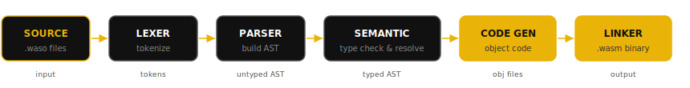

<div align="center">
  

  

  <h1>Write it. Compile it. Run it anywhere.</h1>

  <p>
    <a href="https://readme-typing-svg.demolab.com?font=Fira+Code&weight=600&pause=1200&color=EAB308&center=true&vCenter=true&width=860&lines=Modern+and+type-safe+by+default;Compiles+directly+to+WebAssembly;From+browser+to+server+to+edge;Readable+syntax+without+runtime+bloat">
      
    </a>
  </p>

  <p>
    <a href="https://wasome.dev"></a>
    <a href="https://wasome.dev/docs"></a>
    <a href="https://wasome.dev/tour"></a>
    <a href="https://wasome.dev/playground"></a>
    <a href="https://wasome.dev/examples"></a>
    <a href="https://wasome.dev/install"></a>
  </p>

  <p>
    
    
    
    
  </p>
</div>

<p align="center">
  
</p>

## WASOME

Wasome is a programming language built from scratch to compile to WebAssembly. The idea is simple: a clean, expressive syntax paired with a strong type system that catches your mistakes before they become problems.

Whether you are targeting the browser, a server, or the edge, you write Wasome, compile to Wasm, and it just works.

> **Syntax note:** Wasome uses `<-` for assignment and `->` for return.

Tested on Linux, macOS, Windows, FreeBSD, ARM (aarch64), and ARMv7.
If it runs code, chances are Wasome runs on it.

<p align="center">
  
</p>

## Table of Contents

- [Features](#features)
- [Syntax at a glance](#syntax-at-a-glance)
- [More examples](#more-examples)
- [Explore Wasome](#explore-wasome)
- [Installation](#installation)
- [Architecture](#architecture)
- [License](#license)

<p align="center">
  
</p>

## Features

- **WebAssembly native:** Compiles directly to WebAssembly. No intermediate runtime, no bloat, near-native speed in any Wasm-compatible environment.
- **Type-safe:** Strong static types (`s32`, `u64`, `f64`, `bool`, `char`) plus user-defined types. Bugs are caught at compile time, not at 3 AM.
- **Structs and enums:** Define your own structs and enums, attach methods to them, and model data the way it makes sense to you.
- **Generics:** Full generic support for functions, structs, and enums so code stays flexible and safe.
- **Modules and imports:** Split code across files and projects with straightforward, readable imports.
- **Built-in formatter:** Ships with formatting out of the box. Consistent style, zero configuration.

<p align="center">
  
</p>

## Syntax at a glance

```waso
struct User {
    s32 id
    bool is_active
}

fn main() -> s32 {
    User u <- new User { id <- 42, is_active <- true }

    if (u.is_active) {
        -> u.id * 2
    }
    -> 0
}
```

<p align="center">
  
</p>

## More examples

### Fibonacci sequence

```waso
fn fibonacci(u8 n) -> u64 {
    u64 curr <- 1 as u32 as u64
    u64 prev <- 0 as u32 as u64
    loop (n > 0) {
        u64 temp <- curr
        curr <- curr + prev
        prev <- temp
        n <- n - 1 as u32 as u16 as u8
    }
    -> curr
}
```

### Generics

```waso
struct Box[T] {
    T value
}

enum Option[T] {
    Some(T)
    None
}

pub fn identity[T](T val) -> T {
    -> val
}

fn main() {
    Box[s32] b <- new Box[s32] { value <- 10 }
    Option[f64] o <- Option[f64]::Some(5.5)
    s32 id <- identity[s32](b.value)
}
```

### Multi-file modules

```waso
// main.waso
import "./utils" as u

fn main() -> s32 {
    u.add(1, 2)
    -> 0
}
```

Need more? Check the live examples in `docs/examples/` and on the web examples page:

- https://wasome.dev/examples
- `docs/examples/single_file/`
- `docs/examples/single_project/`
- `docs/examples/multi-project/`

<p align="center">
  
</p>

## Explore Wasome

Everything you need to learn, experiment, and build with Wasome lives at https://wasome.dev.

- **Documentation:** Guides, references, and the full language surface at https://wasome.dev/docs
- **Language Tour:** Interactive introduction with Bit, your friendly star companion, at https://wasome.dev/tour
- **Playground:** Write and run Wasome directly in the browser at https://wasome.dev/playground

<p align="center">
  
</p>

## Installation

Install the Wasome toolchain with one command:

```bash
curl -fsSL https://get.wasome.org/install | sh
```

Then verify your install:

```bash
wasome --version
```

<p align="center">
  
</p>

## Architecture

The Wasome compiler is built in Rust as a modular workspace. Source flows through each stage in sequence:

1. **Source** - load and manage `.waso` files
2. **Lexer** - tokenize source
3. **Parser** - build untyped AST
4. **Semantic analyzer** - type check, resolve symbols, validate
5. **Code gen** - lower to object code
6. **Linker** - produce final binary

<p align="center">
  
</p>

Supporting crates/components:

- `ast` - typed and untyped AST definitions with traversal helpers
- `driver` - orchestrates the full pipeline end to end
- `error` - structured error reporting and diagnostics
- `io` - file I/O utilities
- `formatter` - automatic formatting for `.waso` files

<p align="center">
  
</p>

## License

This project is dual-licensed under your choice of MIT or Apache 2.0.

Built with love and Rust.

https://wasome.dev
